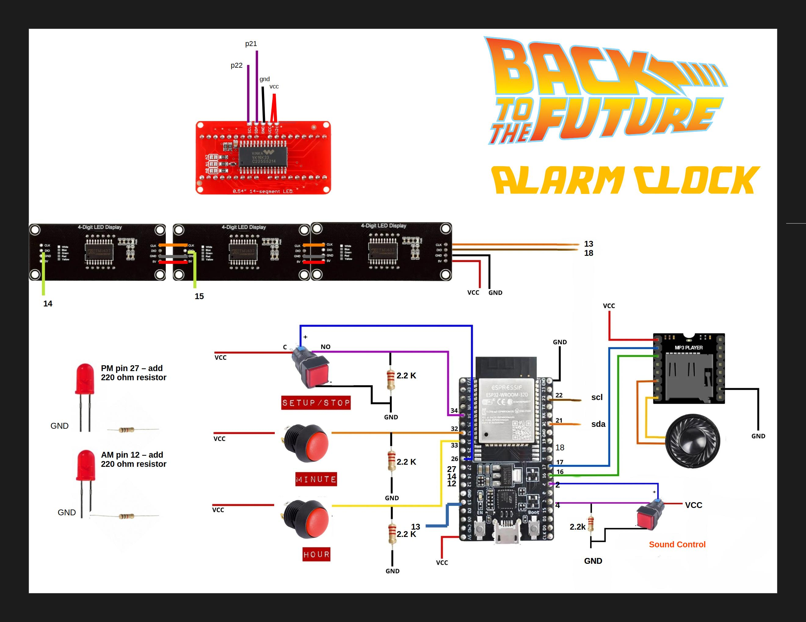
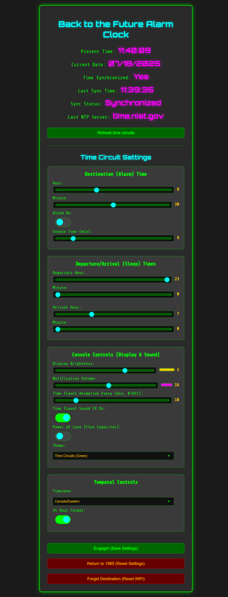

# Back to the Future - ESP32 Alarm Clock

<p align="center">
  
  
</p>

<p align="center">
  <!-- Replace with a GIF or image of your clock in action! -->
  
</p>

> **Great Scott!** It appears you've stumbled upon the schematics for a temporal displacement alarm clock. While this device can't actually travel through time (flux capacitor technology is still a bit tricky), it brings the iconic look and feel of the DeLorean's time circuits right to your nightstand. Using the power of an ESP32 and a little bit of 1.21-gigawatt... I mean, 5-volt... ingenuity, this clock connects to your local WiFi network to display the precise date and time. You can set a "Destination Time" alarm and a "Last Time Departed" sleep schedule, all configurable from a web interface. So, fire it up, but be warned: once this baby hits 88 miles per hour on the display, you're going to see some serious stuff!

---

### Table of Contents
- [Quick Start](#quick-start)
- [Features](#features)
- [Bill of Materials (BOM)](#bill-of-materials-bom)
- [Software & Libraries](#software--libraries)
- [Wiring Guide](#wiring-guide)
- [Installation & Setup](#installation--setup)
- [Usage](#usage)
  - [Web Interface](#web-interface)
  - [Physical Buttons](#physical-buttons)
- [Troubleshooting](#troubleshooting)
- [Example Usage](#example-usage)
- [Contributing](#contributing)
- [License](#license)
- [Acknowledgements](#acknowledgements)

## Quick Start

For experienced makers:
1.  **Gather Components**: Check the [Bill of Materials](#bill-of-materials-bom).
2.  **Assemble Hardware**: Follow the [Wiring Guide](#wiring-guide).
3.  **Prepare SD Card**: Format a MicroSD card (FAT32), create an `/mp3` folder, and copy sound files named `0001.mp3`, `0002.mp3`, etc., one by one in order.
4.  **Flash Firmware**: Open the project in the Arduino IDE or PlatformIO, install the required libraries, and upload the code to your ESP32.
5.  **Configure WiFi**: Connect to the `bttf-clock` WiFi network with your phone/PC, and a captive portal will appear to let you connect the clock to your home network.
6.  **Configure Clock**: Access the web interface at `http://bttf-alarmclock.local` to set the time zone, alarm, and other features.

## Features

This project is packed with features to create an authentic and highly functional alarm clock:

*   **BTTF-Themed Display Layout**: Four displays work together to show the current date and time.
    *   **Month**: An alphanumeric display shows the three-letter month abbreviation (e.g., `JUL`).
    *   **Day**: A 7-segment display shows the day of the month.
    *   **Year**: A 7-segment display shows the full year.
    *   **Time**: A 7-segment display shows the current hour and minute, with a blinking colon.
*   **Accurate & Automatic Time**:
    *   **NTP Time Synchronization**: Automatically fetches and syncs time from multiple fallback NTP servers for high reliability.
    *   **Full Time Zone Support**: Includes automatic Daylight Saving Time adjustments, configurable via the web UI.
*   **Complete Web Interface**:
    *   **Web Configuration Portal**: Configure all settings easily from any device on your network via a web browser at `http://bttf-alarmclock.local`.
    *   **WiFi Manager**: Simple initial WiFi setup using a captive portal. No need to hardcode credentials.
*   **Advanced Alarm System**:
    *   **Configurable Alarm**: Set alarm time, toggle on/off, and configure snooze duration from the web UI or physical buttons.
    *   **Snooze Functionality**: Snooze the alarm with a press of a button.
*   **Authentic Experience**:
    *   **Sound Effects**: Plays iconic sounds from the movie for alarms and animations using a DFPlayer Mini MP3 module.
    *   **Time Travel Animations**: Watch the displays go haywire and the speedometer hit 88 MPH at configurable intervals!
*   **Customization & Convenience**:
    *   **Power Saving Mode**: Displays automatically turn off during user-defined "sleep" hours to save power and avoid nighttime glare.
    *   **Over-The-Air (OTA) Updates**: Update the firmware wirelessly over your WiFi network.
    *   **Web UI Themes**: Change the color scheme of the web interface to match your favorite BTTF aesthetic.
    *   **Physical Button Controls**: Full control over core functions without needing the web UI.

## Bill of Materials (BOM)

This project requires a handful of common electronics components. Below is a detailed Bill of Materials (BOM) for everything you'll need to assemble the clock. The links provided are examples; feel free to source components from your preferred supplier.

### Core Components
| Component | Qty | Notes |
| :--- | :---: | :--- |
| [ESP32 Dev Module](https://www.aliexpress.com/item/1005006212080137.html) | 1 | The brain of the project. Any ESP32 with enough GPIO pins will work. |
| [DFPlayer Mini MP3 Module](https://www.aliexpress.com/item/1005008228039985.html) | 1 | For playing sound effects. |
| [MicroSD Card](https://www.aliexpress.com/item/1005008978876553.html) | 1 | 10MB or larger, formatted to FAT16 or FAT32. For storing MP3 files. |

### Displays & Indicators
| Component | Qty | Notes |
| :--- | :---: | :--- |
| [TM1637 7-Segment Display](https://www.aliexpress.com/item/1005001582129952.html) | 3 | 4-digit displays for Day, Year, and Time. |
| [Adafruit AlphaNum4 Display](https://www.aliexpress.com/item/1005001593666162.html) | 1 | 14-segment I2C display for the month. Any HT16K33-based display should work. |
| [5mm LEDs](https://www.aliexpress.com/item/1005003912454852.html) | 2 | For the AM/PM indicators. |

### Audio & User Input
| Component | Qty | Notes |
| :--- | :---: | :--- |
| [20mm diameter Speaker](https://www.aliexpress.com/item/1005006682079525.html) | 1 | A small 8 Ohm speaker (e.g., 0.5W or 1W) for sound output. |
| [Lighted Tactile Push Buttons](https://www.aliexpress.com/item/1005007163972572.html) | 2 | For Set/Stop and Sound/Toggle. The built-in LED is used for status. |
| [Tactile Push Buttons

## Software & Libraries

This project is built using the Arduino framework for the ESP32. You will need to install the following libraries through the Arduino IDE Library Manager or PlatformIO:

| Library                       | Author              | Purpose                               | Link                                                                    |
| ----------------------------- | ------------------- | ------------------------------------- | ----------------------------------------------------------------------- |
| `WiFiManager`                 | tzapu               | For the WiFi connection portal.       | [GitHub](https://github.com/tzapu/WiFiManager)                          |
| `Adafruit GFX Library`        | Adafruit            | Core graphics library.                | [GitHub](https://github.com/adafruit/Adafruit-GFX-Library)              |
| `Adafruit LED Backpack Library` | Adafruit            | Drives the AlphaNum4 display.         | [GitHub](https://github.com/adafruit/Adafruit_LED_Backpack)             |
| `DFRobotDFPlayerMini`         | DFRobot             | Controls the MP3 player module.       | [GitHub](https://github.com/DFRobot/DFRobotDFPlayerMini)                |
| `ESPAsyncWebServer`           | me-no-dev           | Hosts the web configuration interface.| [GitHub](https://github.com/me-no-dev/ESPAsyncWebServer)                |
| `AsyncTCP`                    | me-no-dev           | Required by ESPAsyncWebServer.        | [GitHub](https://github.com/me-no-dev/AsyncTCP)                         |
| `arduinoJson`                  | bblanchon |        | Handles data for the web API.         | [GitHub](https://github.com/bblanchon/ArduinoJson)                      |
| `TM1637`                      | Avishay Orpaz       | Drives the 7-segment displays.        | [GitHub](https://github.com/avishorp/TM1637)                            |

## Wiring Guide

This guide provides a detailed overview of how to connect all components to the ESP32. It's highly recommended to assemble the circuit on a breadboard first to test all connections before soldering.

<p align="center">
  
</p>

### Power Distribution

**Pro-Tip for Power Rails:** Managing multiple power and ground connections on a breadboard can get messy. For a much cleaner and more reliable setup, consider using **Wago-style lever-nut connectors**. You can run a single wire from your 5V source to one connector and another from GND to a second. Then, simply plug all the individual component VCC and GND wires into their respective connectors. This creates solid, secure power rails without soldering.

All components require a connection to power (VCC) and ground (GND).
*   **5V Power**: Connect the **VIN** pin of the ESP32 to the positive (5V) rail of your power source. Connect the VCC pins of all three TM1637 displays, the Adafruit AlphaNum4 display, and the DFPlayer Mini to this 5V rail.
*   **Ground**: Connect a **GND** pin from the ESP32 to the common ground rail. Connect the GND pins of all displays, the DFPlayer Mini, all buttons, and the negative (cathode) side of all LEDs (via their current-limiting resistors) to this ground rail.
### Display Connections

The clock uses four separate displays that are controlled differently.

#### TM1637 7-Segment Displays
These three displays share a common clock (CLK) line to save pins, but each has a unique data (DIO) line.

| Display Function            | Pin | ESP32 GPIO |
| --------------------------- |:---:| :--------: |
| **All TM1637s (Shared)**    | CLK |    13    |
| Day of Month                | DIO |    18    |
| Year                        | DIO |    15    |
| Time (HH:MM)                | DIO |    14    |

#### Adafruit AlphaNum4 Alphanumeric Display
This display uses the I2C communication protocol.

| Component                 | Pin | ESP32 GPIO |
| ------------------------- |:---:| :--------: |
| **Adafruit AlphaNum4 (I2C)** | SDA |    21    |
|                           | SCL |    22    |
### Audio Connections

The DFPlayer Mini module communicates with the ESP32 using a serial (UART) connection.

| Component        | Pin | ESP32 GPIO | Notes                                  |
| ---------------- |:---:| :--------: | -------------------------------------- |
| **DFPlayer Mini**| RX  |  17 (TXD2) | Connects to the ESP32's **TX** pin.    |
|                  | TX  |  16 (RXD2) | Connects to the ESP32's **RX** pin.    |
|                  | SPK_1 | Speaker +  | Connect one speaker wire here.         |
|                  | SPK_2 | Speaker -  | Connect the other speaker wire here.   |

### Button & LED Connections

The buttons require pull-down resistors (e.g., 10kΩ) to prevent floating inputs. The LEDs require current-limiting resistors (e.g., 220-330Ω) to prevent them from burning out.

| Component          | ESP32 GPIO | Notes                                  |
| ------------------ | :--------: | ----------------------------------------------------------------------------------------------------------------- |
| Set/Stop Button    |     34     | Connect one side to 3.3V and the other to the GPIO pin. Add a 10kΩ pull-down resistor from the GPIO pin to GND. |
| Set/Sound Button   |     4      | Connect one side to 3.3V and the other to the GPIO pin. Add a 10kΩ pull-down resistor from the GPIO pin to GND. |
| Hour Button        |     33     | Connect one side to 3.3V and the other to the GPIO pin. Add a 10kΩ pull-down resistor from the GPIO pin to GND. |
| Minute Button      |     32     | Connect one side to 3.3V and the other to the GPIO pin. Add a 10kΩ pull-down resistor from the GPIO pin to GND. |
| **AM LED**         |     27     | Connect the anode (+) to this pin. Connect cathode (-) to GND via a 220-330Ω resistor. |
| **PM LED**         |     12     | Connect the anode (+) to this pin. Connect cathode (-) to GND via a 220-330Ω resistor. |
| Set/Stop LED       |     26     | Connect the anode (+) to this pin. Connect cathode (-) to GND via a 220-330Ω resistor. |
| Set/Sound LED      |     2      | Connect the anode (+) to this pin. Connect cathode (-) to GND via a 220-330Ω resistor. |
## Installation & Setup

### 1. 3D Print the Housing

A custom-designed housing is available to give your clock an authentic, finished look. The 3D model is provided as a Bambu Studio project file (`bambu studio clock.3mf`).

This project's housing is based on the incredible "Back to the Future Single Time Circuit" model by TerryB on MakerWorld. A huge thank you to to him for his original work and the mods he made at my request to the files! You can find the original model [here](https://makerworld.com/en/models/1154106-back-to-the-future-single-time-circuit#profileId-1537667).

*   **File**: `bambu studio clock.3mf`
*   **Recommended Filament**: For a realistic metallic look, use a metallic grey or silver PLA/PETG filament.
*   **Build Plate**: Printing on a patterned or textured PEI build plate can enhance the metallic effect and give the surface a unique finish.
*   **Infill**: Use an infill of **50% or higher** to ensure the housing is sturdy and durable.
*   **Labels**: The labels for the displays and buttons can be printed using the included `bttf-labels.3mf` Bambu Studio project file. To achieve the white text on the black background, you will need to set a filament color change to **white** at the correct layer height within Bambu Studio.

### 2. Hardware Assembly

Wire all the components together as described in the **Wiring Guide**. Double-check all your connections, especially power and ground, before applying power.

**Pro-Tip:** For initial assembly and prototyping, **Dupont plug-in jumper wires** are highly recommended. They eliminate the need for soldering and make wiring much simpler and reversible. For a more permanent and robust final build, consider soldering components to a perfboard.

### 3. Prepare the SD Card

1.  Format a MicroSD card to **FAT16** or **FAT32**.
2.  Create a folder named `mp3` in the root of the SD card.
3.  Copy your sound effect files into the `mp3` folder. The files must be named in a specific four-digit format: `0001.mp3`, `0002.mp3`, etc.
    *   **Important**: Due to how the DFPlayer Mini module indexes files, you must copy the files to the SD card **one by one, in numerical order**. Start with `0001.mp3`, then `0002.mp3`, and so on. Do not copy them all at once, as this can cause the wrong sounds to play.
    *   `0002.mp3`: Time travel / primary alarm sound.
    *   `0008.mp3`: "Power of Love" easter egg sound
    *   `0010.mp3`: Sleep mode activation sound
    *   `0013.mp3`: "On" or positive confirmation sound
    *   `0014.mp3`: "Off" or negative confirmation sound
    *   ... and other random sounds for the alarm (`0001.mp3` - `0009.mp3`)
4.  Insert the SD card into the DFPlayer Mini module.

### 4. Flash the Firmware
1.  **Set Up Your IDE**: This project can be compiled using the **Arduino IDE** or **PlatformIO** (in an editor like VS Code).
    *   **Arduino IDE**: Install the ESP32 board definitions.
    *   **PlatformIO**: The `platformio.ini` file should handle the setup automatically.
2.  **Install Libraries**: Using your IDE's Library Manager, install all the libraries listed in the Software & Libraries section.
3.  **Configure Default Time Zone (Optional)**: The time zone can be set from the web interface later. However, to set the initial default, open the `.ino` file and find the `timezoneString` in the `defaultSettings` struct. Change it to match your local time zone. You can find a list of valid POSIX TZ strings here.
4.  **Upload Code**: Select your ESP32 board model and the correct COM port, then compile and upload the sketch.
### 5. WiFi Configuration

1.  On the first boot (or after resetting WiFi credentials), the clock will create its own WiFi network with the SSID `bttf-clock`.
2.  Connect to this network with your phone or computer.
3.  A captive portal page should automatically open in your browser. If it doesn't, navigate to `192.168.4.1`.
4.  Click "Configure WiFi", select your home WiFi network from the list, and enter your password.
5.  Click "Save". The clock will restart and automatically connect to your network.

## Usage

### Web Interface

Once connected to your WiFi, you can access the full configuration panel by navigating to **http://bttf-alarmclock.local/** in your web browser.

<p align="center">
  
</p>

From here, you can control all aspects of the clock.
#### Time Circuit Settings
*   **Destination (Alarm) Time**: Use the sliders to set the hour and minute for your alarm.
*   **Alarm On/Off**: A toggle switch to enable or disable the alarm. The `SET/STOP` LED on the clock will light up when the alarm is enabled.
*   **Snooze Time**: A slider to set the snooze duration in minutes (1-59).

#### Departure/Arrival (Sleep) Times
*   These settings define a "sleep" period where the displays will turn off to save power and prevent light disturbance at night.
*   **Departure**: The time the displays will turn off.
*   **Arrival**: The time the displays will turn back on.

#### Display & Sound Settings
*   **Display Brightness**: Adjusts the brightness of all LED displays.
*   **Notification Volume**: Sets the volume for all sound effects from the DFPlayer Mini.
*   **Time Travel Animation Every (min, 0=Off)**: Sets how often (in minutes) the "time travel" animation plays. Set to 0 to disable it.
*   **Time Travel Sound FX On**: A toggle to enable or disable all sound effects, including the alarm. The `SET/SOUND` LED on the clock will light up when sound is enabled.
*   **Power of Love (Flux Capacitor)**: A toggle that triggers the "Power of Love" easter egg sound. This is a one-time trigger and will turn itself off after being activated.
*   **Theme**: A dropdown to change the color scheme of the web interface.

#### Time Settings
*   **Timezone**: Select your local timezone from the dropdown list. This is crucial for correct time display and automatic Daylight Saving Time adjustments.
*   **24 Hour Format**: A toggle to switch the time display between 24-hour format (e.g., 14:30) and 12-hour AM/PM format (e.g., 02:30 PM).

#### Device Management
*   **Save All Settings**: Saves all your changes to the ESP32's memory.
*   **Reset to Default Settings**: Resets all clock settings to their original values and reboots the device.
*   **Reset WiFi Credentials**: Clears the saved WiFi network, reboots the device, and puts it back into AP mode for new WiFi configuration.
### Physical Buttons

The clock can also be operated using the four physical buttons for core functions.

*   **SET/STOP Button**:
    *   **Single Press**: Toggles the main alarm On or Off. A confirmation sound will play, and the corresponding LED will turn on or off.
    *   **Press and Hold**: Enters alarm setting mode.
        *   The time display shows the current alarm time.
        *   While holding, use the **HOUR** and **MINUTE** buttons to adjust the alarm.
        *   Release to save the new alarm time.
    *   **During Alarm**: Stops the currently sounding alarm.

*   **SET/SOUND Button**:
    *   **Single Press**: Toggles all sound effects On or Off. A confirmation sound will play, and the corresponding LED will turn on or off.

*   **HOUR Button**:
    *   **Default Mode**: Decreases the sound effect volume by one step.
    *   **Alarm Setup Mode**: Increments the alarm hour.
    *   **During Alarm**: Activates the **Snooze** function.

*   **MINUTE Button**:
    *   **Default Mode**: Increases the sound effect volume by one step.
    *   **Alarm Setup Mode**: Increments the alarm minute.
    *   **During Alarm**: Activates the **Snooze** function.

*   **Easter Egg**:
    *   Press and hold the **HOUR** and **MINUTE** buttons simultaneously to trigger the "Power of Love" sound effect!

## Troubleshooting
Having trouble? Here are some common issues and their solutions.
*   **Web Interface Not Loading (`bttf-alarmclock.local` doesn't work)**
    *   **mDNS Issues**: Not all networks or operating systems handle `.local` addresses well. Find the clock's IP address from your router's connected devices list or by watching the Serial Monitor in the Arduino IDE when the clock boots up. You can then access the UI by typing the IP address directly into your browser.
    *   **WiFi Connection**: Ensure the ESP32 is connected to your WiFi. If not, it will revert to AP mode (`bttf-clock` network).

*   **Displays Are Not Working or Showing Gibberish**
    *   **TM1637s (Day, Year, Time)**: Double-check the `CLK` and `DIO` wiring. All three displays share the same `CLK` pin, but each must have its own unique `DIO` pin connected to the correct GPIO on the ESP32.
    *   **AlphaNum4 (Month)**: This is an I2C device. Verify that `SDA` and `SCL` are not swapped. You can run an "I2C Scanner" sketch on the ESP32 to confirm the display is detected at address `0x70`.
    *   **Power**: Ensure all displays are receiving a stable 5V.

*   **No Sound from DFPlayer Mini**
    *   **Power Supply**: The DFPlayer can be sensitive to power fluctuations. Ensure you are using a stable 5V power supply capable of providing at least 1A. Powering everything directly from a computer's USB port might be insufficient.
    *   **Wiring**: The most common issue is swapping the RX/TX lines. The DFPlayer's `RX` pin must connect to the ESP32's **TX** pin (`GPIO 17`), and the DFPlayer's `TX` pin must connect to the ESP32's **RX** pin (`GPIO 16`).
    *   **SD Card Format**: The card **must** be formatted as FAT16 or FAT32.
    *   **File Structure**: Ensure there is a folder named `mp3` in the root of the SD card and that your sound files are inside it.
    *   **File Naming & Copying**: Files must be named `0001.mp3`, `0002.mp3`, etc. **Crucially**, you must copy them to the SD card one by one, in numerical order. If you copy them all at once, the player's file index will be incorrect.

*   **Time is Incorrect**
    *   **WiFi**: The clock needs an internet connection to sync with NTP servers.
    *   **Timezone**: Make sure you have selected the correct timezone in the web UI and saved the settings.
    *   **Firewall**: Some restrictive networks may block NTP traffic (UDP port 123).

*   **Buttons Are Unresponsive or Behave Erratically**
    *   **Pull-Down Resistors**: Each button requires a 10kΩ pull-down resistor connecting its GPIO pin to Ground (GND). Without these, the input pin is "floating" and can trigger randomly.
    *   **Wiring**: Double-check that one side of the button is connected to 3.3V and the other side is connected to both the GPIO pin and the pull-down resistor.

## Example Usage

Let's walk through a common scenario: setting up the clock for a typical weekday morning.

**Goal:**
*   Wake up at **7:30 AM**.
*   The displays should turn off at night, from **11:00 PM** to **6:30 AM**.
*   The clock is located in **New York (Eastern Time)**.
*   The display brightness and alarm volume should be at a comfortable, medium level.
*   The "Time Travel" animation should play every **15 minutes**.
*   Both the alarm and general sound effects should be enabled.

Here’s how you would configure this using the web interface at `http://bttf-alarmclock.local/`:

1.  **Set the Alarm Time**
    In the "Destination (Alarm) Time" section, adjust the sliders to your desired wake-up time.
    ```
    Destination Hour: 7
    Destination Minute: 30
    ```

2.  **Enable the Alarm**
    Ensure the main alarm is active by flipping the toggle switch. The `SET/STOP` LED on the clock will light up.
    ```
    Alarm On/Off: On
    ```

3.  **Set the Sleep Period**
    In the "Departure/Arrival (Sleep) Times" section, define when the displays should turn off and on.
    ```
    Departure (Sleep): 23:00
    Arrival (Wake): 6:30
    ```

4.  **Set the Timezone**
    In the "Temporal Controls" section, select the correct timezone from the dropdown menu to ensure accurate time, including DST changes.
    ```
    Timezone: Canada/Eastern
    ```

5.  **Adjust Display Brightness**
    In "Console Controls," set the `Display Brightness` slider to a medium level, like `4`.
    ```
    Display Brightness: 4
    ```

6.  **Adjust Sound Volume**
    Set the `Notification Volume` slider to a moderate level, such as `20`.
    ```
    Notification Volume: 20
    ```

7.  **Configure Animation Frequency**
    Set how often the time travel animation plays. A 15-minute interval is a good starting point.
    ```
    Time Travel Animation Every: 15 min
    ```

8.  **Enable All Sounds**
    Make sure the `Time Travel Sound FX On` toggle is enabled. The `SET/SOUND` LED on the clock will light up.
    ```
    Time Travel Sound FX On: On
    ```

9.  **Save Your Settings**
    Click the **Engage! (Save Settings)** button at the bottom of the page to apply all your changes.

10. **All Set!**
    Your clock is now configured. It will wake you up at 7:30 AM, stay dark overnight, and provide some fun temporal displacement effects throughout the day.

---

## Contributing

Contributions are what make the open-source community such an amazing place to learn, inspire, and create. Any contributions you make are **greatly appreciated**.

If you have a suggestion that would make this better, please fork the repo and create a pull request. You can also simply open an issue with the tag "enhancement". Don't forget to give the project a star! Thanks again!

---

## License

```text
MIT License

Copyright (c) 2025 Randall North

Permission is hereby granted, free of charge, to any person obtaining a copy
of this software and associated documentation files (the "Software"), to deal
in the Software without restriction, including without limitation the rights
to use, copy, modify, merge, publish, distribute, sublicense, and/or sell
copies of the Software, and to permit persons to whom the Software is
furnished to do so, subject to the following conditions:

The above copyright notice and this permission notice shall be included in all
copies or substantial portions of the Software.

THE SOFTWARE IS PROVIDED "AS IS", WITHOUT WARRANTY OF ANY KIND, EXPRESS OR
IMPLIED, INCLUDING BUT NOT LIMITED TO THE WARRANTIES OF MERCHANTABILITY,
FITNESS FOR A PARTICULAR PURPOSE AND NONINFRINGEMENT. IN NO EVENT SHALL THE
AUTHORS OR COPYRIGHT HOLDERS BE LIABLE FOR ANY CLAIM, DAMAGES OR OTHER
LIABILITY, WHETHER IN AN ACTION OF CONTRACT, TORT OR OTHERWISE, ARISING FROM,
OUT OF OR IN CONNECTION WITH THE SOFTWARE OR THE USE OR OTHER DEALINGS IN THE
SOFTWARE.
```

---

## Acknowledgements

This project wouldn't be possible without the hard work of the open-source community and the creators of the fantastic libraries used. Special thanks to the teams behind the ESP32 Arduino core, WiFiManager, and all the Adafruit and DFRobot libraries. A huge thank you to TerryB on MakerWorld for the original 3D model design and for making modifications upon request.
